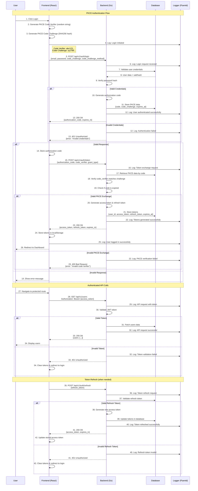

# IDM Application - PKCE Login Flow Diagram

## Overview
This diagram shows the complete PKCE (Proof Key for Code Exchange) authentication flow for the IDM application, including both frontend and backend interactions.

## PKCE Login Flow



## PKCE Security Benefits

### 1. **Code Verifier Protection**
- **Code Verifier**: Random string generated by client
- **Code Challenge**: SHA256 hash of code verifier
- **Protection**: Prevents authorization code interception attacks

### 2. **Flow Security**
- **Step 1**: Client sends code challenge (not verifier)
- **Step 2**: Server stores code challenge with authorization code
- **Step 3**: Client sends code verifier to exchange for tokens
- **Step 4**: Server verifies code verifier matches stored challenge

### 3. **Token Management**
- **Access Token**: Short-lived (15-60 minutes)
- **Refresh Token**: Long-lived (7-30 days)
- **Automatic Refresh**: Frontend handles token renewal

## Implementation Details

### Frontend (React)
```typescript
// PKCE Code Generation
const generateCodeVerifier = () => {
  const array = new Uint8Array(32);
  crypto.getRandomValues(array);
  return base64URLEncode(array);
};

const generateCodeChallenge = async (verifier: string) => {
  const hash = await crypto.subtle.digest('SHA-256', 
    new TextEncoder().encode(verifier));
  return base64URLEncode(new Uint8Array(hash));
};
```

### Backend (Go)
```go
// PKCE Validation
func validatePKCE(code, codeVerifier string) bool {
    // Retrieve stored code challenge
    storedChallenge := getStoredCodeChallenge(code)
    
    // Generate challenge from verifier
    computedChallenge := generateCodeChallenge(codeVerifier)
    
    // Compare challenges
    return storedChallenge == computedChallenge
}
```

## Error Handling

### Common PKCE Errors
1. **Invalid Code Verifier**: Mismatch with stored challenge
2. **Expired Authorization Code**: Code used after expiration
3. **Missing PKCE Parameters**: Required parameters not provided
4. **Invalid Grant Type**: Incorrect grant_type in token request

### Logging Points
- Login initiation
- Authentication success/failure
- PKCE validation results
- Token generation and refresh
- API request authentication

## Security Considerations

### 1. **Code Verifier Requirements**
- Minimum 43 characters
- Maximum 128 characters
- Use cryptographically secure random generation
- URL-safe base64 encoding

### 2. **Code Challenge Methods**
- **S256**: SHA256 hash (recommended)
- **plain**: No transformation (deprecated)

### 3. **Token Security**
- Store tokens securely (httpOnly cookies recommended)
- Implement token rotation
- Monitor for suspicious activity
- Log all authentication events

### 4. **Rate Limiting**
- Limit login attempts per IP
- Implement exponential backoff
- Monitor for brute force attacks

## Monitoring and Observability

### Key Metrics
- Login success/failure rates
- PKCE validation success rates
- Token refresh frequency
- Authentication latency
- Error rates by type

### Alerts
- High authentication failure rates
- Unusual PKCE validation failures
- Token refresh anomalies
- Geographic login anomalies

This PKCE flow provides robust security for your IDM application while maintaining a smooth user experience. 